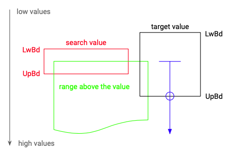
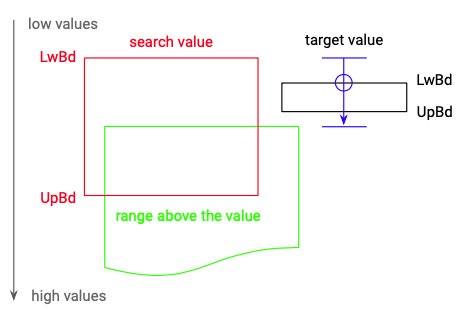

# Search Params

## Ordinal Parameter Types

### Ranges

Searches on decimal, date and quantity are always involve implicit or explicit ranges.

#### Decimal

For decimals the number of significant digits determines the implicit range.

**Examples**

| Number | Range |
| :--- | :--- |
| 2 | \[1.5, 2.5\) |
| 2.0 | \[1.95, 2.05\) |

#### Date

For dates the number of specified components defines the implicit range. So if only the year is specified, the range covers the whole year. The same is true for month, days and so on.

**Examples**

| Date | Range |
| :--- | :--- |
| 2020 | \[2020-01-01T00:00:00.000, 2020-12-31:23:59:59.999\] |
| 2020-02 | \[2020-02-01T00:00:00.000, 2020-02-31:23:59:59.999\] |
| 2020-02-13 | \[2020-02-13T00:00:00.000, 2020-02-13:23:59:59.999\] |
| 2020-02-13T13:08 | \[2020-02-13T13:08:00.000, 2020-02-13:13:08:59.999\] |

### Prefixes

The ordinal parameter types number, date and quantity use prefixes on search values to control the matching process. Because the search always operates at ranges for both the search value and the target value, interval arithmetic is used to describe matching.

#### Equal

TODO

#### Greater Then

The greater than operator is defined so:

> the range above the search value intersects \(i.e. overlaps\) with the range of the target value

The range above the value is defined so:

> the range above 2.0 includes any value greater or equal to 2.00000000000000000000



In figure 1, values spread along the Y-axis starting at low values on top of the figure and increase to the bottom of the figure. The search value is red and has a thickness which corresponds to their precision. For example if the search value is 2.0 its lower boundary \(LwBd\) would be 1.95 and it's upper boundary \(UpBd\) would be 2.05. In green there is the "range above the value" which reaches from the exact search value 2.00000 up to infinity. On the right there is one possible matching target value in black. Its precision is lower so it stretches more along the Y-axis.

Target values match if their range intersects with the range above the value. In order to decide whether a target value matches, one has to evaluate the following inequation:

```text
UpBd(target-value) >= search-value
```

So the upper boundary of the target value has to be greater or equal to the exact search value.

### Greater Equal

The greater equal operator is defined so:

> the range above the search value intersects \(i.e. overlaps\) with the range of the target value, or the range of the search value fully contains the range of the target value

The first condition is the same as in greater than. In addition to that greater equal adds the ranges of target values which are fully contained in the range of the search value.



The above figure shows an additional matching target value. In order to find such values their lower boundaries have to be greater or equal to the lower boundary of the search values and their upper boundaries have to be less than the exact search value.

```text
LwBd(target-value) >= LwBd(search-value) && 
UpBd(target-value) < search-value
```

The rest of the matches will be found by the inequation for grater than.

